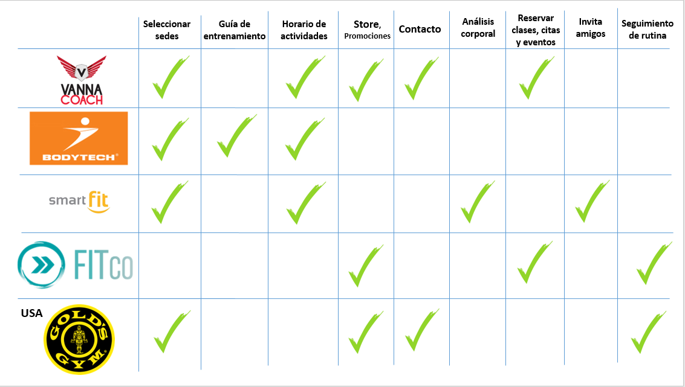
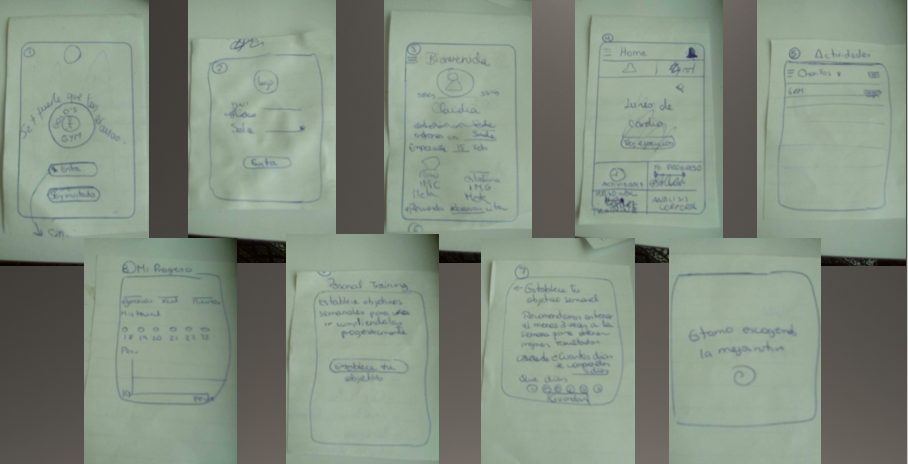

# Gold`s Gym App

Gold´s Gym es la firma de gimnasios mas grande a nivel internacional, con más de 700 locales en los 5 continentes. Figuras como Arnold Schwarzenegger se entrenaron en sus instalaciones, brindándole autoridad en el mundo fitness.

Es por ello que el presente proyecto consiste en la creación  de una aplicación móvil para el gimnasio Gold´s Gym con el fin de mantener una mejor relación con el usuario brindandole una atención personalizada en beneficio a mejorar la salud, conseguir un mejor fisico y sentirse bien consigo mismo.

## Propuesta:

No es novedad que vamos a un gimnasio y encontramos personas haciendo ejercicio junto a un compañero muy popular: el smartphone, esto puede suponer un problema a la hora de realizar rutinas efectivas, es por ello que la propuesta de este proyecto es convertir el smartphone en un aliado para el logro de objetivos personales. 

## Objetivo:

Desarrollar una aplicación que brinde el seguimiento personalizado a traves de las diferentes rutinas de ejercicio y guias de alimentación segun los objetivos de cada persona.

## Etapa de Investigación y Research:

### Investigacion Cualitativa:

### Benchmarking:

Para este análisis se hizo una comparación y research de las app´s de los gimnasios locales como Vanna Coach, Bodytech y Smart Fit que serian su competencia directa, asi mismo del software para gimnasios Fitco y de la aplicación del Gold´s Gym en Estados Unidos, en lo cual se concluye lo siguiente:

En este gráfico, se puede observar que:

**Vanna Coach:** *Puntuación:* 4.9 / *Descargas:* 1 mil

Es un centro de entrenamiento peruano con 3 sedes en Lima y tiene la app más completa, ya que tiene mas funciones que el resto como el hecho de seleccionar las sedes, lo cual es importante para saber cual es la instalación mas cercana. 
Tambien figura los horarios de actividades de entrenamiento y clases grupales con una pequeña descripción y el coach que estará a cargo, en las cuales se puede reservar con anticipación un espacio.

Además se puede comprar los servicios de membresías desde la app ya sea para renovar o comprar desde un inicio. Posee dos *call to action* para llamar al local o visitar la página web.

**Bodytech:** *Puntuación:* 3.4 / *Descargas:* 10 mil

Bodytech es un club médico deportivo que cuenta con 24 sedes en todo el Perú, y es la principal competencia directa de Gold´s Gym en nuestro país.

Su aplicación es básica pero personalizada, ya que cuenta con un perfil donde figura la edad, peso y estatura y el nombre del coach a cargo, además de imágenes con los ejercicios a realizar y las repeticiones. También se puede seleccionar las sedes.

**Smart Fit Colombia:** *Puntuación:* 3.0 / *Descargas:* 50 mil

Smart Fit es una cadena de gimnasios de Latinoamérica que en el 2017 se instaló en el Perú y cuenta con 5 sedes a nivel nacional.

Sin embargo la app que analizaremos será la de Colombia, ya que no tiene una peruana.

Su app ofrece la busqueda de sedes y el horario de actividades para reservar como las apps anteriores. Aunque cabe resaltar que tiene otras funciones interesantes como el análisis corporal en un gráfico en el cual se puede ver la variación de peso, grasa y músculo durante el tiempo que permanezca en el gym, tambien cuenta con la opción de invitar amigos.

**Fitco:** *Puntuación:* 4.4 / *Descargas:* 1 mil

Fitco es una app peruana y un software especializado para la gestión de gimnasios y centros de entrenamiento, sin embargo Gold´s Gym no es socio de Fitco.

Fitco propone funciones interesantes para los gimnasios, como el hecho de reservar cupo para las sesiones de entrenamientos y clases grupales, funciona como un punto de venta de membresias y los usuarios pueden hacer un seguimiento de su rutina.

**Gold´s Gym USA:** *Puntuación:* 3.0 / *Descargas:* 100 mil

En primer lugar la app no usa los colores institucionales de la marca, lo cual no genera identidad. Sin embargo, es clara en las funciones que ofrece como encontrar clases segun las sedes y se puede ver las promociones de las membresias, tambien brinda seguimiento de las rutinas.

#### Observacion Contextual:

*Sede* : Chorrillos
*Ubicación* : Plaza Lima Sur - 2do piso

Para esta observación, acompañé a Laura Marin, una amiga que se inscribirá al Gold´s Gym Chorrillos por el periodo de 3 meses. Su principal motivación es adelgazar y tonificar su musculatura.
La observación que relataré sera acerca del día que ella ingresa y algunos alcances posteriores durante el tiempo que permanecerá en el gimnasio.

*Miércoles 14 de marzo*

Laura entra al local que queda en el segundo piso del Centro Comercial, es un local espacioso, cuenta con una cafeteria que se puede ver al ingresar y unos sillones que reciben calidamente.

Se dirige de frente a hablar con los chicos que están en los cubiculos de atención al cliente, una señorita de polo rojo y sonrisa amplia la recibe y Laura le dice que quiere informes. La deriva con un chico al cual llama por un micrófono, y lo presenta diciendo, el es Gianfranco su asesor de ventas. El chico la saluda muy alegre y le acompaña a su escritorio.

Laura le menciona que quiere inscribirse y quiere saber si hay ofertas, el asesor le cuenta que a partir de 3 meses le puede hacer un buen descuento, Laura lo acepta y paga a través de su tarjeta de crédito, le dan un sobre con el contrato, una tarjeta donde figura su numero de socia, le toman una foto improvisada para colocarlo en su base de datos y le da la bienvenida.

Gianfranco, el asesor de ventas, le dice que el segundo paso es agendar una cita con la nutricionista para que le haga la evaluacion nutricional, y que regrese mañana ya que ahora no hay cupos para que la atienda, pero que si gusta puede empezar a ejercitarse desde ya. Laura prefiere esperar, ella quiere saber sus medidas antes de hacer el ejercicio para hacer la comparación del antes y después.

*Jueves 15 de marzo*

Gianfranco programó a Laura una cita con la nutricionista a las 9 de la mañana. Laura estuvo desde las 8:50 esperando, por fin, pudo entrar a las 9:03. Lo primero que hizo fue rellenar una cartilla con sus datos y le preguntaron cuales son sus objetivos y  si antes habia tenido alguna lesion muscular o si le habian operado y algunas preguntas sobre sus habitos alimenticios.
Luego procedieron a pesarla, medirla, sacarle el IMC y el Indice de Grasa, lo cual le parecio muy importante conocer.

Laura queria que le proporcionen un plan nutricional pero eso tenia un costo aparte le dijeron. Acto seguido, la nutricionista le presentó a su Personal Trainer y le entregó la plantilla que previamente rellenaron.

Su personal trainer Dennis, hizo su rtuina en la cartilla poniendole el numero de repeticiones y los ejercicios que Laura tendria que hacer para conseguir sus objetivos mencionados antes a la nutricionista.

Ese dia comenzó su rutina primero haciendo ejercicio cardiovascular con 4 máquinas distintas y luego ejercicios localizados. El primer dia su personal trainer le enseñó como ejecutar los ejercicios, sin embargo tenia que buscarlo despues de cada ejercicio porque en ese momento tambien habian otras personas a las que estaba enseñando. Laura se sintió relajada y motivada.

*Viernes 16 de marzo*

Al dia siguiente, Laura no pudo ir temprano por la mañana como habia quedado, asi que fue por la noche y encontró el gimnasio repleto a eso de las 7pm y su entrenador no se encontraba. Segun ese dia tenia que entrenar tren superior y saco su cartilla de ejercicios para ver lo que tenia que hacer, pero estaba un poco desorientada ya que no conocia cual era la maquina indicada para determinado ejercicio.

Finalmente le pidio ayuda a uno de los personal trainer que andaba por ahi, uno le explico rapidamente como tenia que hacer el primer ejercicio de la lista y se fue porque lo estaban llamando. Y asi se pasó su hora de gym buscando entrenadores para que la guien, lo cual no le generó una buena sensación, ya que no se sintió guiada del todo. Luego, quizo entrar a una clase de spinning y le dijeron que ya estaban ocupadas todas las bicicletas y que separe su lugar para la siguiente hora, lo cual ella no sabia que tenia que hacer porque tampoco en ningun lugar del gimnasio figuraba el horario de actividades de ese dia.

*Conclusiones:*
En esta observación de 3 días, se pudo observar los siguientes problemas:
- Espera por la cita con la nutricionista.
- No le brindan consejos de nutricion.
- No hay una orientacion ni seguimiento adecuado para los miembros nuevos en el desarrollo d sus ejercicios.
- No figura un horario en las instalaciones del local.
- Tiene que reservar con anticipacion para las clases grupales.

#### Entrevistas:

Se realizaron 5 entrevistas a personas activas en el gimnasio Gold`s Gym de la sede de Chorrillos, las cuales respondieron las siguientes preguntas y a continuación un breve resumen de las respuestas:

1. ¿Por que elegiste Gold´s Gym?
    
    Respondieron por la cercanía, variedad de máquinas,porque tiene prestigio, etc.

2. ¿Cuales fueron tus principales objetivos al entrar al gimnasio?

    La mayoria respondio bajar de peso y tonificar.

3. ¿Sientes que te hacen un seguimiento tanto a nivel fisico como nutricional?

    Los cinco entrevistados respondieron de forma unánime que no, que los instructores los dejan a la deriva, y que no se sienten guiados, asi que muchos de ellos hacen los ejercicios por su cuenta (4 de 5).

4. ¿Crees que la rutina que haces es la mas eficaz para lograr tus objetivos?

    3 de 5 personas respondieron que creen que si, ya que les dan una cartilla con los ejercicios que tienen que hacer de acuerdo al objetivo que quieren lograr, sin embargo, les parece tedioso usar la cartilla ya que muchas veces se ha extraviado y han demorado tiempo en encontrarla. Ademas que algunos tambien ven videos en Youtube de ejercicios y muchos son parecidas. Los 2 restantes siguen su propia rutina de entrenamiento.

5. ¿Como te enteras de los horarios de clases y de los eventos del gym?

    Comentaron que ponen afiches de los eventos en las paredes del gimnasio, pero que no han participado en ninguno ya que se les pasa la fecha pero que les gustaria. Y sobre los horarios de clases se enteran una vez que llegan al gimnasio que clase hay. Dos de ellos no asisten a actividades grupales, solo hacen máquinas.

6. ¿Te han brindado tu plan nutricional? o Sigues un plan nutricional?

    Coincidieron que a ninguno se les brindó un plan nutricional ya que tiene un costo aparte el cual es elevado y no lo han adquirido. Así que 2 de 5 no siguen ningun plan nutricional y los 3 restantes visitan blogs de nutricion o miran videos de Youtube y con eso se guían.

7. ¿Haz entrado a la pagina web del gimnasio? ¿Que te parecio?

    3 de 5 respondieron que si y que les pareció pobre ya que los botones de ver el horario de clases y otros más no funcionan correctamente.

8. ¿Utilizas alguna app movil fitness?

    2 personas usan app´s para mejorar su rendimiento en el gimnasio: Una app que recuerda tomar agua, otra usa JEFIT que es un app donde figuran ejercicios para realizar en el gimnasio .

9. ¿Acompañas tus ejercicios con suplementos?

    3 personas consumen o han consumido suplementos, 1 de ellas lo adquirió en el mismo gimnasio y las demás en otros establecimientos.

10. ¿Usarias una app movil del gimnasio para tener a la mano el horario de clases, ver tu progreso y que te brinde consejos de alimentacion?

    Por unanimidad respondieron que si ya que les ayudaría bastante en la ejecución de sus rutinas y a no perderse las clases o los eventos.

### Investigación Cuantitativa:

Se realizaron 19 encuestas a través de internet a personas que hayan sido clientes de gimnasios y otras que actualmente se ejercitan en uno y los resultados fueron los siguientes:

En la muestra investigada existen mas mujeres que hombres que asisten o han asistido al gimnasio.

Se observa que de 15 a 19 años, existe un 15.8%. De 20 a 25 años es el 42.1%, de 26 a 30 años es el 36.9% y de 30 a 40 años es el 5.3%. En su mayoria, el rango de edad que va mas al gimnasio o ha ido es de 20 a 25 años.

El 47.4% (9) no va actualmente, el 31.6% (6) va de 3 a 4 veces por semana, el 15.8% (3) de 1 a 2 veces y el 5.3% (1) va de 6 a 7 dias.

La mayoria de personas, el 73.7% elije un gimnasio por el precio, por la variedad de actividades un 57.9%, porque tienen amigos ahí el 31.6% y por cercania y actividades un 26.3% cada uno.

De los encuestados el 63.2% su principal motivación al ir a un gimnasio es que puede bajar de peso el 63.2%, tonificar y aumentar masa muscular el 47.4% cada opción.

Al 63.2% evaluaron fisicamente cuando ingresaron mientras que al 36.8% no.

Al 52.6% no le dieron consejos de nutrición, mientras que al 47.4% si.

La mayoria de personas no sienten que le hacen un seguimiento de su rendimiento fisico el tiempo que pertenece en el gimnasio , el 52.6% (10). Solo el 21.1% (4) cree que si.

Y estas fueron las razones que manifestaron:

Al 94.7% le parece importante conocer su progreso físico en el gimnasio, sin embargo esta necesidad no esta siendo cubierta.

El 68.4% no pudo lograr la meta que se propuso en el gimnasio, mientras que el 31.6% si lo logró.

El 68.4% utiliza su celular en el gimnasio, a veces lo usan un 10.5% y no usan un 21.1%.

*Conclusiones:*

- La mayoria de la población que va son millenials.(79%)
- Eligen el gimnasio por el precio y la variedad de actividades.
- Las personas presentan objetivos claros al entrar al gimnasio.
- Existe una evaluación física pero no hay un seguimiento y esto afecta al logro de objetivos.
- No reciben  consejos de nutricion.
- La mayoria usa su celular cuando entrena.
- Los problemas encontrados fueron: Falta de información, no hay seguimiento en las rutinas y que no hay muchos trainers guiando.

*Imágenes adjuntas*:

### Business Model Canvas:
 

# Etapa de Ideación y Síntesis:

## User Persona:

Con la información recaudada del research previa, se construye nuestra User Persona.

## Problem Statement:

Usamos el siguiente patrón para definir el problema.

**{Mariam}** *quisiera* **saber los horarios de las actividades grupales y de los eventos para no perderse los que mas le interesan.**

**{Mariam}** *necesita* **una guía de la rutina a realizar para estar motivada y saberse segura que llegará a su objetivo.**

**{Mariam}** *quisiera* **tener amigos con los cuales retarse y compartir sus metas.**

**{Mariam}** *necesita* **conocer su progreso personal y estar al tanto de las evaluaciones físicas.**

## How might we? (HMW):

¿*Cómo podríamos* dar a conocer los horarios de las actividades grupales y eventos?

¿*Cómo podríamos* ofrecer una guia de rutina personalizada?

¿*Cómo podríamos* que los socios tengan amigos con los cuales manterse motivados compartiendo metas y retándose?

¿*Cómo podríamos* informar el progreso personal de cada socio?

## What if? :

¿What if si vinculamos el horario de las clases grupales y eventos a la app movil?

¿What if si despues de registrarse hacemos preguntas basicas para ofrecer una guia de rutina personalizada?

¿What if si creamos una comunidad de los socios Gold´s para que puedan ser amigos y compartir sus metas entre ellos?

¿What if si brindamos el progreso personal segun como vayan avanzando en una seccion de menú?

## Paper Prototyping:

#Testing:

Se realizaron 3 testings con el Prototipado en papel, en los cuáles se identificaron las siguientes mejorías:

- "Definir la sección de Rutina, ya que no se entiende con claridad."

- "Me gustaría ver las actividades (horario) que más se acomoden a mí, no todas"

- "Sería bueno definir que objetivo se quiere lograr, si quiero entrenar solo piernas o brazos, etc."

- "Desde el inicio no sería bueno traumar con las medidas, empezar con algo motivador"

# Prototipado en Alta Fidelidad

Para ver el proyecto completo, dar click ---> https://marvelapp.com/project/2819886/

### Algunas vistas:

### Herramientas que se usaron:
- Figma
- Marvel

### Elaborado por : 
Claudia Zarate

### Desarrollada para:
Laboratoria Lima

### Promoción: 
2018-01

